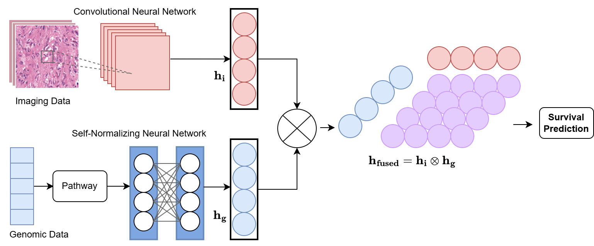

# An Algorithm That Combines Genetic and Image Features for Outcome Prediction

Summary: This study proposes a multimodal fusion machine learning model that integrates histopathological images and gene expression data. To address the high dimensionality of the genomic modality, we designed a feature extraction strategy that incorporates pathway layers and self-normalizing neural networks. For image data, convolutional neural networks were employed. Features from both modalities were fused using tensor product fusion and optimized using the Cox loss function, with the concordance index used as the evaluation metric.

# Setup
- argparse: 1.1
- torch: 1.13.1+cu116
- pandas: 2.2.3
- torchvision: 0.14.1+cu116
- torch_geometric: 2.6.1
- PIL: 10.4.0
- numpy: 1.26.4
- lifelines: 0.30.0
- matplotlib: 3.9.2
  

# Code Base Structure
The code base structure is explained below:

- `data_loader.py` is used to load the data required for training and testing, and returns the data in the correct format for the PyTorch DataLoader according to the model's requirements.
- `loss_function.py` provides the CoxLoss for training and evaluating survival analysis models.
- `main.py` is the main program, handling data, model setup, training, evaluation, and result visualization for the survival analysis workflow.
- `network.py` contains PyTorch model definitions for all unimodal and multimodal network.
- `train_test.py` contains the definitions for "train" and "test".
- `util.py` provides tools to plot loss and C-index for visualizing training and validation.
  

# Dataset

The contents in the directory `.\data\TCGA_GBMLGG` are as follows:

* **all\_dataset.csv**: Contains survival time, censoring status, and expression values of 4,088 genes for 508 TCGA IDs.
* **grade\_data.csv**: Contains age, sex, histological grade, and subtype information for 769 TCGA IDs.
* **pathway\_mask.csv**: Contains the mapping relationships between 574 biological pathways and 4,088 genes.
* **all\_st**: Includes 1,505 histology ROIs (1024 × 1024, stain-normalized) from 769 TCGA IDs for training the histology CNN.
* **simulated\_img**: Contains 2,000 simulated pathological images.
* **spilt**: Stores pre-divided training and testing data, including gene data, histology ROI indices, survival times, and censoring status. File format: pickle.

"# An_Algorithm_That_Combines_Genetic_and_Image_Features_for_Outcome_Prediction"  
